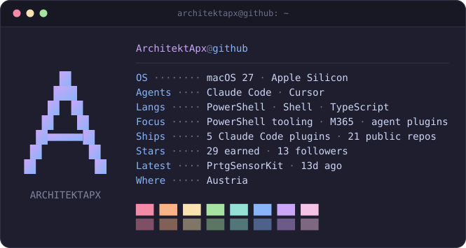

<picture>
  <source media="(prefers-color-scheme: dark)" srcset="assets/fetch-dark.svg">
  <source media="(prefers-color-scheme: light)" srcset="assets/fetch-light.svg">
  
</picture>

**I write PowerShell that survives production, and agent tooling that survives review.**

## PowerShell

- **[PrtgSensorKit](https://github.com/ArchitektApx/PrtgSensorKit)** · Framework for building PRTG custom sensors. Less boilerplate, valid output every time.
- **[Invoke-EzNameApi](https://github.com/ArchitektApx/Invoke-EzNameApi)** · PowerShell client for the easyname.com API.
- **[Measure-EventLogVolume](https://github.com/ArchitektApx/Measure-EventLogVolume)** · Estimate Windows event log volume before you commit to Sentinel ingestion costs.

## Agent tooling

- **[Auth-Guard](https://github.com/ArchitektApx/Auth-Guard)** · Claude Code plugin that keeps secrets out of context and transcripts.
- **[powershell-expert](https://github.com/ArchitektApx/powershell-expert)** · Claude Code plugin for PowerShell work, from one-off scripts to published modules.
- **[cursor-skills-for-claude](https://github.com/ArchitektApx/cursor-skills-for-claude)** · Cursor's official agent skills, packaged as Claude Code plugins and installable for any agent via npx.
- **[Vibe-Driven-Development](https://github.com/ArchitektApx/Vibe-Driven-Development)** · A planner, coder and reviewer loop that raises the quality of what an LLM ships.
- **[HackerNews-Brief](https://github.com/ArchitektApx/HackerNews-Brief)** · Personalized Hacker News briefs inside Claude Code. Learns your interests from what you click.
